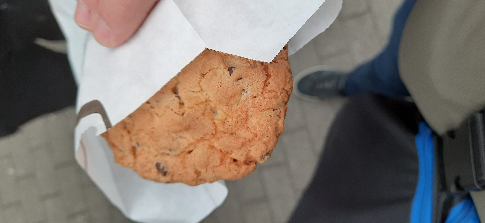

Last weekend, I got the chance to visit FOSDEM 2024 in Brussels, Belgium. This was the second time I was able to visit Europe's largest open source software summit alongside my colleagues and openSUSE members.

Last year, after FOSDEM 23, I felt that I didn't make the most of it, only visiting two or three talks and spending the rest of the time talking mainly to my apprentice colleagues or my friend at the KDE booth.

This year, I wanted to change that. And boy did I.

## Planning? To hell with that...

Just like last year, I did not look up what talks were scheduled until I had breakfast on Saturday morning and was heading up to the ULB, the Free University of Brussels. Quite the planner i know...

I have to say, the selection was great this year. I was especially interested in the Rust devroom, as I am lately learning and using Rust quite intensively for a project I am working on (and probably will talk about here soon). So I wanted to use this chance to take away as much as possible from the talks there.

When we arrived around 10am though, my colleague and I quickly learned that the Rust devroom was a **very** popular destination. The line was stretched alongside the narrow corridor of Building H.

Sadly due to this I missed the first 3 talks. Semantic Versioning, Writing a Rust linter, GCCRS, And Hardware pointer checks.

## Day 1 - Spending a Day with Rust

We decided to wait in fron of the door for the whole time of the last one of these talks and then, finally were let inside for the main talks we wanted to see:

- "*Proving Performance*" by Nikolai Vasquez his performance benchmarking tool [`Divan`](https://nikolaivazquez.com/blog/divan/) and how to correctly assess performance in Rust
- "*[The Four Horsemen of Bad Rust Code](https://github.com/corrode/four-horsemen-talk)*" by Matthias Endler about the four major pitfalls of Rust development.
- "*Introducing Ratatui*" by Orhun Parmaksiz introducing us to the impressive TUI framework Ratatui. (Something I am very interested in as I like TUIs very much.)

We spend about 4 hours in the Rust devroom and I cannot say I regretted one minute of it.

I would not call myself too deep in Rust, but I was able to take a lot away from these talks still. Especially the Four Horsemen one.

After these, we decided to take a quick break, stretch out our legs and check the schedule for other talks. Maybe in a more well ventilated room. (Did i mention that the Rust devroom was a windowless seminar room?)

We checked the main tracks in Building K and found a very intriguing title: "*One way forward: finding a path to what comes after Unix*".

A very interesting talks by Liam Proven about the growing complexity of Unix systems, especially the Linux Kernel, and what comes after.

As we arrived early we were also able to catch the last 10 minutes of the previous talk about the D programming language. I was fascinated. I knew about D before but I have never heard of anyone using it. I felt it was more like something like F#, which exists but there seems to be little fuss around it. Seeing someone actually talk about it as a main track on FOSDEM was pretty cool, and I will definitely go back and watch the video recording of that.

## Day 2 - A day with systemd

To be hones, I really did not have a plan for day 2. Okay, not that I had a solid plan for day 1 to begin with to be honest...

We spent the day mostly in the distributions dev room starting very early with Lennard Poettering's talk about UKIOs and TPMs. A topic I am wholly unqualified to talk about to be honest. Though the talks were very interesting and I took notes of keywords to look up later. Something that I can only recommend to everyone who wants to learn about new topics: Watch talks of people, take notes of words you do not know and look them up. It's a pretty sound strategy I find.

The talk that followed that was also very interesting: "*Adapting Your Project: Making Changes Without Breaking Linux Distributions*"by Fernando Fernandez Mancera. As someone who hopes to have one of his projects being part of a Linux distribution one day this was very interesting for me.
Things like properly documenting changes, providing new features and changes as an opt-in first, and properly communicating with the community and package maintainers are all things that I have had contact with in the past few weeks and months to varying degrees, so the talk was very fitting for me.

After that, we decided to take a long break, meet up with other colleagues and have some in-promptu baguette lunch on a concrete retainer wall in front of building H.

Then we went to the last talk for me: "*The Monolith versus the Swarm*" by Den Cermark. A comparison between the monolithic approach to packaging of openSUSE with OBS, and the swarm approach of Fedora. The main takeaway was: Both suck in their own way. While being great at the same time. I was surprised (and disturbed) by the number of systems Fedora uses for packaging, and felt Den smacking the complicated configuration of OBS. As someone who has packaged a Python application and tried (unsuccessfully) to package a Ruby application, I felt that a lot.

One other talk which I would like to mention was about building a public cloud for 5 million students. It was held by someone from OwnCloud and mentioned their path to providing millions of students in Europe and their schools with cloud solutions. This included ByCS or "Bayerncloud Schule". A system ordered by the state of Bavaria's education ministry which I am very familiar with due to my regular blocks of schools during my apprenticeship.
The talk confirmed by suspicions that the regular downtimes, bugs and other problems we have with ByCS and its integrated applications (Especially Mebis (A Moodle fork) and the new ByCS Messenger (A custom patches version of the Element Matrix client)) are less of an issue with the system itself, or the used FOSS tools, but rather with he inability of the ministry of education to set up their stuff correctly (indicated by ByCS Messenger's inability to exchange keys).

This together with the lack of upstream contributions by state institutions are a different topic which I will try to dive into another time.

## Actually talking to people

Aside from visiting talk and eating Baguette and very nice hummus off a concrete wall, I was able to connect with some people as well. Of course I stopped by at the KDE both to visit my friend and acquire a T-Shirt and a very cute hand made plush Konqi through a donation. (Just look at the guy).

Apart from that I was able to network more with other SUSE and openSUSE colleagues that I usually don't get the chance to meet. A few very interesting and funny discussions occurred there.

## Summary

Being able to visit FOSDEM is always a great thing. It has been a fun and very very educational event for me and I can only recommend anyone who is into IT, and wants to learn more about open source to go. Admission is free, you only have to get there and sleep somewhere. It really is worth it.

Though at some point FOSDEM must get out of that university. Space really felt like it was a problem.

## Some more pictures.

Here are now some more pictures I took in Brussels for the ones interested.

This was probably one of the, if not the, most dominating feature of the area where our hotel was.

This massive tower just loomed over the surrounding buildings, ominously illuminated by a white LED outline. What it is? Some government building, perhaps? Some mega corporations HQ? Nah, according to the letters on the other side of the building it is another Hotel. Creatively named "The Hotel".

It's ominous though, isn't it?

This little guy was a gift by a colleague. He had to think of me, isn't that nice?

The little guy got a special place on my TwinkPad.

(No affiliation with the company btw. Though they seem to be interesting from their webiste.)

A statement I wholeheartedly agree with put up by the Mozilla folks next to their little pink food truck.

What food they handed out?

Well, cookies of course. Of course they first asked for permission ;). Unlike certain other browsers...

Though it would have been funny having people dressed up as Chrome or Edge running after people throwing cookies in their face.

---

That's it though. Post's over. My trip to FOSDEM 24. See you all next time!
