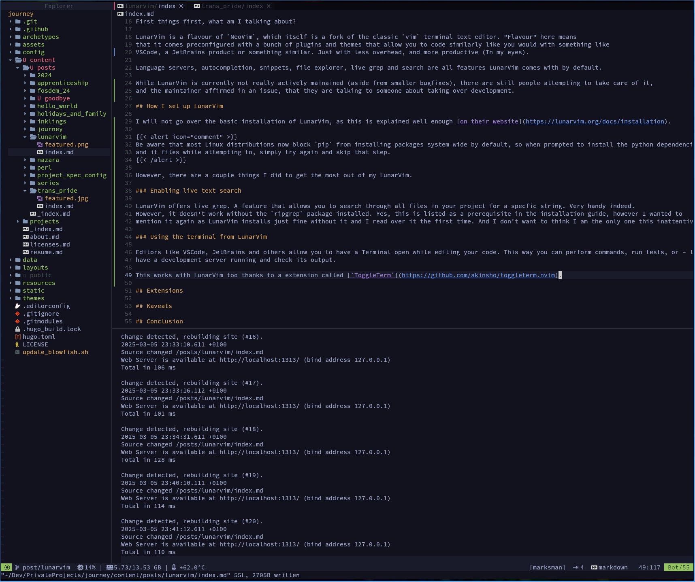
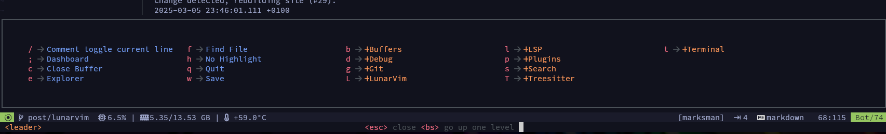
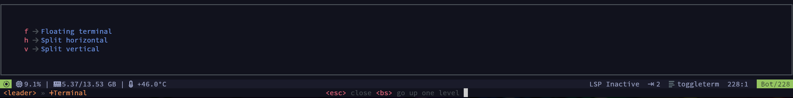
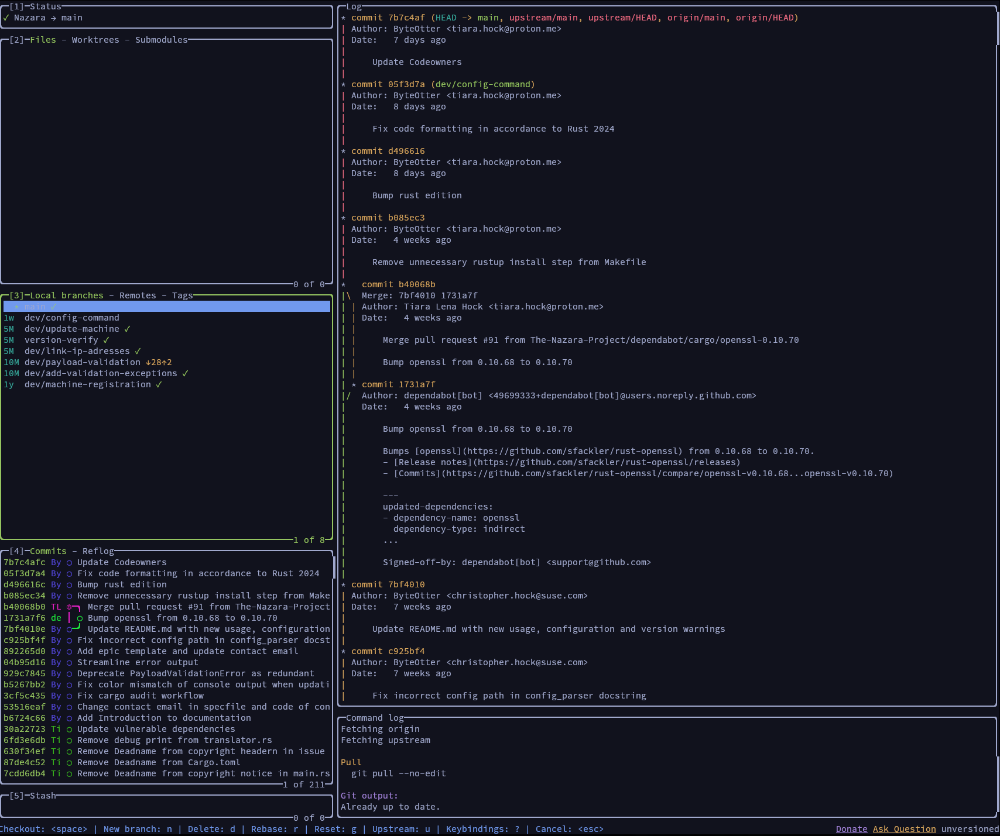

[In a less than recent blogpost](../project_spec_config/) I mentioned that I primarily use [LunarVim](https://lunarvim.org) as my
text editor / IDE of choice.

I would like to dive a little bit into my experiences and my specific setup as someone who mainly programs in Rust, Python and C.

## What is LunarVim?

First things first, what am I talking about?

LunarVim is a flavour of `NeoVim`, which itself is a fork of the classic `vim` terminal text editor. "Flavour" here means 
that it comes preconfigured with a bunch of plugins and themes that allow you to code similarly like you would with something like 
VSCode, a JetBrains product or something similar. Just with less overhead, and more productive (In my eyes).

Language servers, autocompletion, snippets, file explorer, live grep and search are all features LunarVim comes with by default.

While LunarVim is currently not really actively mainained (aside from smaller bugfixes), there are still people attempting to take care of it,
and the maintainer affirmed in an issue, that they are talking to someone about taking over development.

## How I set up LunarVim

I will not go over the basic installation of LunarVim, as this is explained well enough [on their website](https://lunarvim.org/docs/installation).


Be aware that most Linux distributions now block `pip` from installing packages system wide by default, so when prompted to install the python dependencies
and it fails while attempting to, simply try again and skip that step.


However, there are a couple things I did to get the most out of my LunarVim.

### Install a NerdFont

Now, this is important. If you want LunarVim to properly display filetypes and directory icons, or generally properly display things, you will need a [NerdFont](https://www.nerdfonts.com/).

Simply select one you like, download it and install it wherever your distro stores its fonts. For openSUSE Tumbleweed, that's `~/.local/share/fonts`.
You will probably also have to tell your terminal emulator you're using to use this font, so head to your favourite search engine to look up on how to do this.

For the one I am using, Kitty, you can specify it in its config.

```ini
# ~/.config/kitty/kitty.conf
font_family CascadiaCode NF
bold_font CascadiaCode NF
italic_font CascadiaCode NF
bold_italic_font CascadiaCode NF

# Whatever you want
font_size 11.0
```

Depending on what font you use, you need to put other values there for the `bold_font`, `italic_font` and `bold_italic_font` options.
Something like `SauceCodePro NF Italic` or something. You'll figure it out. If an option does not exist, it will fall back to your `font_family` setting.
Afterwards, restart your terminal.

### Enabling Live Grep 

LunarVim offers live grep. A feature that allows you to search through all files in your project for a specfic string. Very handy indeed.
However, it doesn't work without the `ripgrep` package installed. Yes, this is listed as a prerequisite in the installation guide, however I wanted to
mention it again as LunarVim installs just fine without it and I read over it the first time. And I don't want to think I am the only one this inattentive, right?

### Using the Terminal from LunarVim

Editors like VSCode, JetBrains and others allow you to have a Terminal open while editing your code. This way you can perform commands, run tests, or - like me right now -
have a development server running and check its output.

This works with LunarVim too thanks to a extension called [`ToggleTerm`](https://github.com/akinsho/toggleterm.nvim).



LunarVim comes with `ToggleTerm` by default. However, it's default keybinds are either broken, or didn't work for me. So I changed them:

```lua
-- ~/.config/lvim/config.lua

-- Setup ToggleTerm terminal. This allows you to open a Terminal by pressing <LEADER>+t+<MODIFIER>
lvim.builtin.which_key.mappings["t"] = {
  name = "+Terminal",
  f = { "<cmd>ToggleTerm<cr>", "Floating terminal" },
  v = { "<cmd>2ToggleTerm size=30 direction=vertical<cr>", "Split vertical" },
  h = { "<cmd>2ToggleTerm size=30 direction=horizontal<cr>", "Split horizontal" },
}
```

This adds a new section to the main menu which appears when you press your `<leader>`-Key (that's `Spacebar` by default).



When pressing `t`, it opens another menu allowing you to spawn either a horizontal, vertical, or floating terminal.



When you select your choice, a fresh session of your default shell will be spawned. Be aware, this means that any credentials or environment variables set in the session
that LunarVim is running in **will not be inherited**. So if you need your SSH key, you have to add it to your agent again.

### Easily use Git from LunarVim

Most IDEs allow you to make git commits without using the Terminal, right from within the IDE itself. Good news, LunarVim can do that too.
And it's super easy to set up. All you need is to install [`lazygit`](https://github.com/jesseduffield/lazygit), a TUI based graphical git frontend
that's very easy to use after a short learning curve. It's packaged for most common distros so it's always 
just one bash command away.

```bash
# openSUSE Tumbleweed example
sudo zypper in lazygit
```

That's it. Now you can open lazygit by pressing `<leader>+g+g`. It can do pretty much anything you could ever need (including asking for your SSH and GPG credentials if needed).



Of course, as it's a standalone application you can also use it anytime in your terminal no matter what editor you use. But why would you use anything else?

### Installing Plugins

Of course you can install more plugins to LunarVim, if you encounter anything else you need.

I will use this section to shamelessly self plug my own to demonstrate how easy this is to do.
Let's use my own NeoVim plugin called `sysmon`. As the name implies, it shows you system ressource utilization in the status bar at the bottom of the screen.
Something that I - given that I usually have a hidden dock by default - find very helpful.

To install it, simply list the plugin in your config:

```lua
-- ~/.config/lvim/config.lua
lvim.plugins = {
    {
        "git@github.com:BytePaws/sysmon.nvim", tag="v0.1.1",
        config = function()
        local sysmon = require('sysmon')
        sysmon.setup({
            update_interval = 2000,
            use_icons = true,
        })
        end,
    },
}
```

Don't be confused about the username, this is my alternate GitHub account (long story, don't ask). Now, everything besides the git URL is technically optional, but
most plugins to require calling their config or setup functions, so best you read the installation guide of the plugin to see how to do this. In this example sysmon's
config allows you to change the update interval (in milliseconds) as well as whether you want to have icon or text labels.
Also, you don't have to provide a tag, however if you don't it will apparently take `HEAD` of the repository, which is not always the best idea.

### Installing Themes

Installing themes is even more easy than installing plugins. You simply list them in in the `lvim.plugins` table of your config like this.

```lua
-- ~/.config/lvim/config.lua
lvim.plugins = {
    {
    "git@github.com:tiagovla/tokyodark.nvim", name = "tokyodark", priority = 1000
    },
}
```

This is the theme I currently use, it's dark and vibrant, however, if you are looking for something soothing, I can recommend [ribru17's bamboo.nvim](https://github.com/ribru17/bamboo.nvim).

LunarVim offers a live theme selector for the current session, which is nice and allows you to temporarily change the current theme, however if you close and open LunarVim again, it will revert 
to its own default theme.
To avoid that simply change it in the config:

```lua
-- ~/.config/lvim/config.lua
lvim.colorscheme = "tokyodark"
```

## Kaveats

The biggest kaveat with using LunarVim is, that it's currently almost unmaintained. Now, it is stable (at least the newest version v1.4) even when using a far more modern version of NeoVim
beneath it, and the plugin manager `Mason` is able to update LSPs, etc. without issue.

Apart from that, sometimes LunarVim is not able to automatically download language servers. It is supposed to, and mostly does that just fine when first opening a new code file, and also 
can hook things like `rust_analyzer` in when it's installed, but sometimes it cannot and you have to manually install it.

Now, the only language I really had trouble it was `C#`. I know, C# is terrible, noone should use it and I should be ashamed it even touched my pure innocent little Tumbleweed TwinkPad.
However during my apprenticeship I was practically forced to, and let me tell you, **it sucked**.

I did get the LSP to work so I could ditch terrible terrible VSCode, to the confusion and detriment of my teacher, and once it worked it actually worked well.

This is the snippet of my config, just in case you are crazy enough to touch this cursed excuse of a language too.

```lua
-- ~/.config/lvim/config.lua

vim.list_extend(lvim.lsp.automatic_configuration.skipped_servers, {
    "csharp_ls",
})
lvim.lsp.automatic_configuration.skipped_servers = vim.tbl_filter(function(server)
    return server ~= "omnisharp"
end, lvim.lsp.automatic_configuration.skipped_servers)
```

As you can see, I tell LunarVim to use the `omnisharp` LSP instead of the `csharp_ls` it initially tried, because that one was not working right and would crash (thankfull, if a LSP crashes, it
does not crash the whole editor.)

There are also more "nieche" LSPs you can install manually, like things for Markdown and Markup languages, but I would first try to find it through the Mason interface (simply enter `:Mason` when in command mode)
as it's just way easier.

## Conclusion

That's it I think. Now you have LunarVim about as set up as I do. If you want my config, you can find it in my [Gists](https://gist.github.com/ByteOtter/1465245bb65d9802e8c0bdd4d3d337b6).

I think the main concluding point here is that I like LunarVim a lot, there's a reason why it has become my main editor for the past 2 years at this point.
The question is now yours whether or not you are comfortable with using an almost unmaintained editor or not. If you're not, there are other great NeoVim flavours out there, [AstroNvim](https://github.com/AstroNvim/AstroNvim) comes to mind there as 
pretty similar to LunarVim.

Whether you are going to try it out or not I hope you had fun reading. And I hope I can post more guides of stuff in the future. I just need to find the times.

Anyway, I'll see you next time. :otter:
