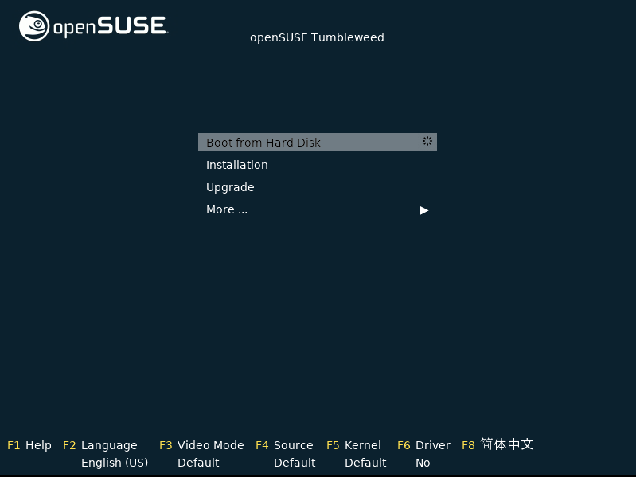
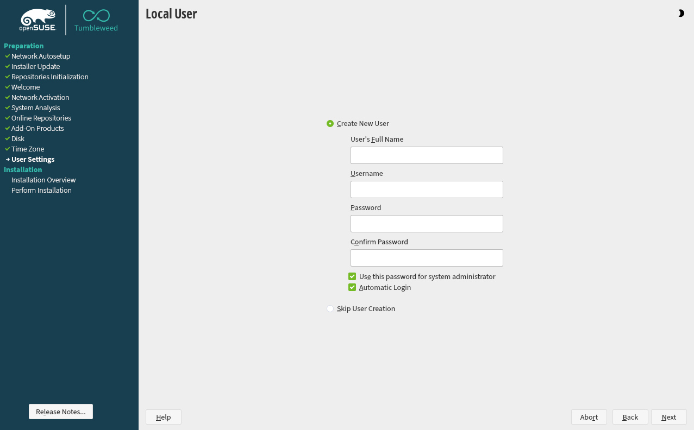
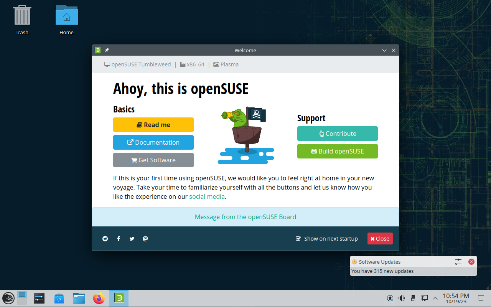

# Before we start

In this guide I will assume you install `openSUSE Tumbleweed` directly on a computer. If you want to do weird stuff
like virtualization (running it in a VM) you can do so too by following this guide. However, potential issues with your
VM setup, especially with the VM not accessing the Internet are on you. Maybe I will do a series or excursion to
virtualization in the future.

## Step 1: Creating a bootable device

> Hint: If you plan on installing Tumbleweed in a Virtual Machine, you can safely skip the rest of this step after
> downloading the OS's `.iso` image from [get.opensuse.org](https://get.opensuse.org/tumbleweed/?type=desktop#download).

To install any operating system on a computer you need to create a medium which you can boot from first.
Usually this is done with a regular USB-Stick.

First you will need to download the ISO. As we are using `openSUSE Tumbleweed` in this example, you can download the
operating system here: [get.opensuse.org](https://get.opensuse.org/tumbleweed/?type=desktop#download).<br>
When you follow this link you will be greeted by a large selection of download options. Worry not, as this overview
presents you with all the different computer architectures that Tumbleweed supports. Each with its own image.

If you have a reasonably modern computer that you want to install the OS on you can safely choose the upper left
box where it says `Intel or AMD 64-bit desktops`. This version of the OS is built for 64-bit CPUs. To the right of
this selection are the images for 32-bit PC processors. If you have a very old machine that you wish to revitalize
this will most likely be the option for you.

> Hint: If you are unsure which architecture your system has, stand by as I am working on an excursion on how to find out
> and why this matters. Until then Google is your friend, simply Google the PC or CPU you have and it will tell you.

No matter what you choose you will have the choice between a `Network Image` or an `Offline Image`. As the name implies
this choice decides how much you will need to download, and if your system will need internet access for the installation.

**The Offline Image comes with all necessary packages** for a complete installation. (Download size ~4.5GB), while the
**Network Image** will need to **download** these packages from the Internet and basically only comes with the installer
(a couple hundred megabytes).

No matter which image you choose, you will need to flash it to a volume that your system can boot from. Most commonly
nowadays this is done using a USB stick.

I will not go over on how to create a bootable USB-Stick in this guide. There are many articles out there which explain
this process step by step with every tool under the sun. I have two good ones right here:

- **On Windows** the tool I recommend for creating bootable USB devices, or SD cards, is
  [`Balena Etcher`](https://etcher.balena.io/) it's quite literally a 3 click process. Just download the ISO, select the
  USB-device and off you go.
- In the off-chance you are **using Linux**, you probably already know how to do it using the `dd` command.
  In case you do not, however, here is an example:
  ```bash
  sudo dd if=openSUSE-Tumbleweed.iso of=/dev/sdb status=progress
  ```
  This can take a while to complete. **Do not forget** to replace `/dev/sdb` with the correct device name. You can check
  this by using `lsblk` followed by `sudo umount <DEVICE>`.

## Step 2: Installing

Now that you have your boot device we can start installing. For that simply plug in your USB and power on your machine.

It may be necessary for you to enter the UEFI/BIOS, the basic system that runs beneath the operating system on any PC
and select the boot device manually. Pay attention to the screen when you boot. If it flashes something on the screen
along the lines of **"Press XYZ to enter Boot Menu"** hit that key and select your USB device.

You should now see this selection screen:



If you do, you have the option to `"Boot from Hard Disk"` to try out Tumbleweed before the install or directly hit
`Installation`.

You will now be guided through the installation process by `YaST` or "Yet another Setup Tool". This is, amongst other things, a
comprehensive system configuration and management tool for openSUSE and SUSE Linux distributions.
It provides a user-friendly, graphical interface to handle various tasks such as software installation, system updates,
hardware configuration, partitioning, and network settings and much more. We will come back to YaST in the future.

Follow the instructions of the installer like you would with Windows or any other operating system.
It will ask you to enable or disable `software repositories`. In the Linux world software is provided as `packages`
which are stored in`repositories`. You can imagine a `repository` as being a directory on a server containing a set of
software which you can install on your system. We will go into detail on how software management works on Linux systems
in the next part of this series. You can safely **accept the default repositories**.

These three repositories should be selected by default:

- `Main Update Repository`, the main repository for system updates
- `Main Repository (OSS)`, the main repository for open-source software you can install
- `Main Repository (NON-OSS)`, the main repository for non-open-source, or proprietary software you may need (or not)

The other two options include debug utilities and source code files for software, but they are prone to break things
if you do not know what you are doing so we are going to ignore them now. Just hit **Next**.

After that you can make the most significant choice of your life. Or probably not. But it **is** the most significant
choice of your installation process: <br> **The Choice of your Desktop Environment**

### Desktop Environments

A desktop environment is the part of your Linux distribution which allows you to control its functionality through
a graphical user interface (GUI). There are dozens of options with various benefits and draw backs. Some are more
Windows oriented, while others are more minimalistic. Some only include window management while others bring the full
desktop experience to life.

The choice here really is yours, as it should be.

openSUSE Tumbleweed allows you to choose between the three most popular desktop environments: `KDE Plasma`, `GNOME`
and `Xfce`. It also allows you to install a `Generic Desktop` which is a very minimalistic desktop environment
that we will ignore. Moreover it allows you to **not install a desktop at all**. Yes, this is a possibility with most
Linux distributions. As the operating system as a whole is technically completely separate from the desktop environment.
In theory this also allows you to uninstall your current desktop and install a new one, though I cannot recommend that
as some parts of your desktop environment, like credential handling and login, may interact with your OS in certain
ways making these applications difficult to replace.

Anyways let's talk about the options at hand:

#### KDE Plasma

Plasma is a feature-rich and highly customizable desktop environment developed by [KDE](https://kde.org/) which has been
around since 1996.

In its base form it feels very familiar to the Windows desktop you might be used to, but where its strength really lies
is in its customization options. From color schemes to themes to custom workspace behavior and plugins the KDE
community has your back for almost anything. Take a look at [Reddit](https://www.reddit.com/r/LinuxPorn/search/?q=KDE+Plasma&type=link&cId=577267f1-fa12-47f4-a9bb-735635cadfa3&iId=be19d561-db0e-4be0-abb6-f8c3bb94357a) and see what people turn their basic Plasma into, you got everything from funny
to outright stunningly beautiful.

It can be a bit icky at times, but personally I think it is worth it.

#### GNOME

[GNOME](https://www.gnome.org/) is a very user-friendly, modern looking desktop environment that reminds me more of MacOS or now Windows11 in its
design language. While it is by far not as modular or customizable as KDE Plasma is, it offers enough options to feel
at home and fit the environment to your workflow.

GNOME users say they find it being more reliable than Plasma as it allows less externally maintained plugins to interfere
with the DE's behavior.

#### Xfce

Xfce is a light-weight minimal desktop environment which is about as old as KDE Plasma is. It is often celebrated
for its reliability and criticized for its slow update cycle and outdated feel.

However, it stays to this day as one of the most popular desktop environments.

So, which should we choose? I will **choose KDE Plasma** because of personal experience and bias. Of course you are free
to choose whatever you like, though be aware that some the stuff in this series may not apply for you or may be
different depending on the desktop you choose.

### Partitioning

The next step would be partitioning your disk. As we are setting up our system from scratch, we can safely accept the
suggested partitioning. However, if you want to dual boot a linux partition side-by-side with a Windows partition you
may want to check out a guide on configuring this.

Just hit next.

### User Creation

For time reasons I will skip the configuration of you location and timezone as this should be self explanatory.

Last stop is the user creation.

Users in a Linux operating system have similar functionality to users in a Windows or MacOS setting. Each user has
their own files, applications and settings and is independent from other users.



There will be a proper excursion on the types of users on a Linux system in the future, though I will give you a short
overview here.

Generally, on a Linux system, you can divide users into three categories:

|Regular Users|Root Users|Service Users|
|-|-|-|
|Are the standard users you create with your installation.|Are **superusers** who have administrative privileges.|Are special users created and used by certain services.|
|Each user has their own `home` directory which contains all that user's files, configurations and applications.|Has unrestricted access to all files and applications at each location of the system.|e.g. Apache, Docker, email, etc.|
|Saving or editing outside the `home` directory is **not permitted**|Can delete/edit **any system file**, though some critical operations may require additional confirmation.||
|Similar to the concept of user profiles in Windows, where each user has their own files and settings.|Similar to the Administrator account on Windows, though even more powerful.||

On the user creation screen, you can enter a username and set a password. Or you can even skip user creation by ticking
the "Skip User Creation" box. This is an option that does not make sense for our use case, but can be handy in a setting
where you need to run a lot of commands that require root privileges.

## Hello World!

Great! Once the install is completed you should be greeted on your next boot with you very own openSUSE system!



Thank you for reading through this guide. In the next one we will take a look around and how to install your software.

In the meantime you can click on the `Read me` button and take a look at Tumbleweed's documentation.

I will see you next time!

---

## Glossary

This was a lot of information thrown at you all at once I know.

Here a quick overview of words used so far.

|Phrase|Description|
|-|-|
|`Linux`|Refers to the **family of operating systems using some form of the Linux kernel**.|
|`Distribution`|Refers to a specific kind of Linux OS (like Ubuntu, openSUSE, Debian, etc.).|
|`Graphical User Interface / GUI`|All visual elements you can interact with or that represent data.|
|`Desktop Environment (DE)`|The component of a Linux OS that handles the visual interpretation and representation of data and applications and allows for interaction using a GUI.|
|`.iso image`|A operating system "image" is simply a digital copy of an operating system that comes in the format of a `.iso`-file.|
|`software package`|Compressed archive containing all necessary files and data to install and run a give software.|
|`(software) Repository` / `repo`|A storage location from which your system's package manager can access and install software packages.|
|`package manager`|A program which is used to manage, install, uninstall or update installed software packages on your system, apply system updates etc.|
