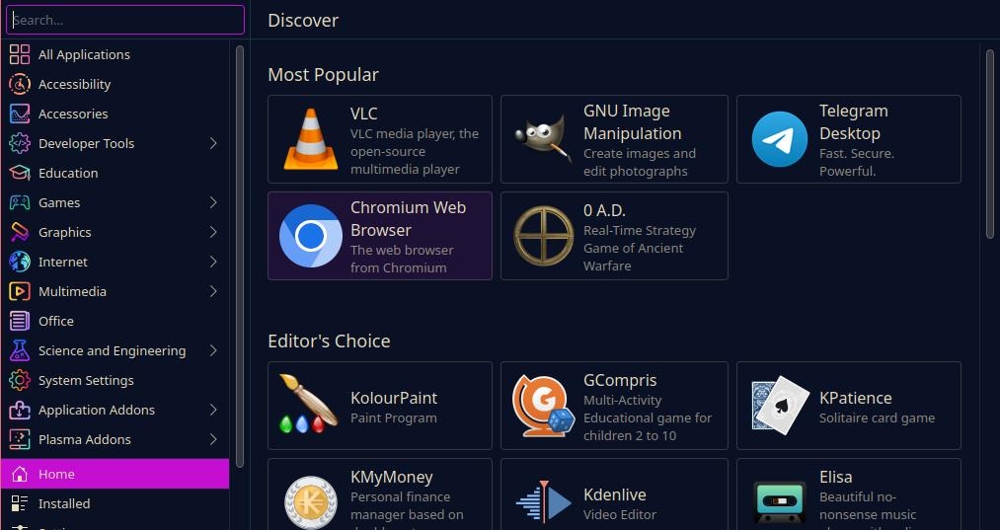
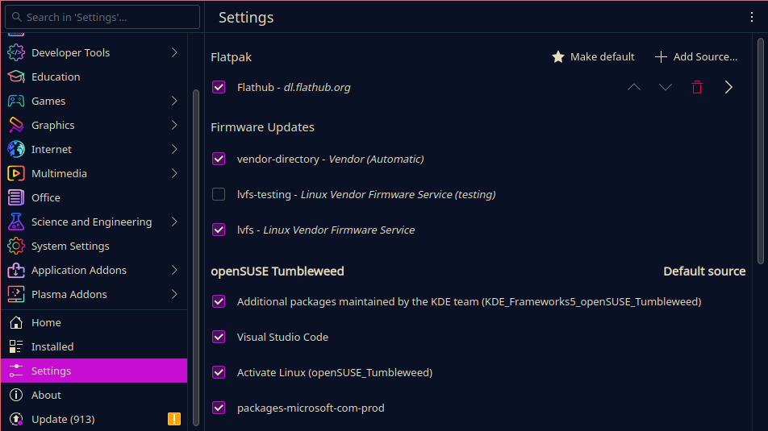

## Your workspace

In the previous installments of this series, we went over the general terms of the Linux world and installed your first Linux distribution `openSUSE Tumbleweed`.

What you see now on your screen will look somewhat familiar to other operating systems you may be used to. And that's by design.

A lot of `Desktop Environments` for Linux distributions try to resemble other operating systems. KDE in particular looks and feels very similar to your pre-Windows-11 Windows desktop.

## How software works in Linux

In the Linux world, software comes in the form of software `packages`. These `packages` are a collection of files and metadata which make up a specific software application.

They come in the form of package files, with the most popular packaging formats being `.deb` and `.rpm`.

In our case, openSUSE Tumbleweed uses the `.rpm` package file format.

### The package manager

The `package manager` is one of the most important parts of your Linux system that you will be interacting with directly.

A `package manager` is a software tool that lets you install, update and remove pretty much all software on your computer. It automates the entire process around your software including tasks like dependency management, updates, authenticity checks and conflict checking.

Package managers are also used for system updates as they also keep track of all software packages your system needs to function alongside the software you install as the user.

The `package manager` gets its software from the `software repositories` we briefly covered previously.

#### Software Repositories

`Software/Package repositories` are the backbone of the Linux ecosystem. They are the source of all software you can install on your system using your `package manager`.

You can imagine a repository as a directory on a server. Your `package manager` checks that directory every time you want to install or update software if it is available, downloads and installs it for you. All major distributors of Linux operating systems provide their own sets of standard repositories for their distribution which contain software, which is usually checked for errors and safety and will work with your system mostly out of the box.

The default repositories we chose during installation will contain **most** of the software you could ever want to install, though it **is possible to add new repositories**.

Be careful though, adding new repositories maintained by people you do not know or trust may lead to unwanted side effects.

### The software center

Our Tumbleweed install, or rather its Desktop Environment KDE, comes with a dedicated Software Center called **"Discover"**.



Discover basically handles like a (slow) App Store you might be familiar with on Windows or MacOS. You can search and install software and updates via a nice, simple graphical interface.

In the background, Discover runs the same terminal commands you would when you would install or update software via the Terminal; It just provides a nice graphical interface, so you do not have to use the terminal at all in day-to-day use.

For our guide, however, we want to go over the Linux basics so we will use the Terminal to at least understand how to do this. (You will not always have a desktop interface or software center anyways.)

So, let's take a look at some of our commands of Tumbleweed's `package manager` called `zypper`:

#### Search software

```bash
sudo zypper search $PACKAGE
```

This command tells `zypper` to search for a certain software in its online repositories.

It will return a table to you that shows you all packages it found containing the name you specified instead of the `$PACKAGE` placeholder here.

#### Install software

```bash
sudo zypper install $PACKAGE
```

To install software you use this command. Your package manager will then search for it in its repositories and if found, list what packages will be installed.

In that list, you might notice that not only will it install the package you specified, but additional packages as well.

This is because most software requires additional packages to be installed as dependencies. Do not worry though, `zypper` will not install dependencies you already have installed again as long as they are compatible.

You can shorten this command like this:

```bash
sudo zypper in $PACKAGE
```

#### Remove software

```bash
sudo zypper remove $PACKAGE
```

This will tell `zypper` to search for and remove a package you installed.

```bash
sudo zypper rm $PACKAGE
```

#### Update software

```bash
sudo zypper update $PACKAGE
```

Using this command, you can update individual software packages.

#### Show software details

```bash
zypper info $PACKAGE
```

This will make `zypper` search for and print info about the specified package.

#### System update

```bash
sudo zypper dup
```

This will tell `zypper` to perform a system update. It will then refresh its repositories and search for updates for all installed packages including all system packages.

**Note**: Unlike Windows, most Linux distributions will not force you to reboot after a software update. Some distributions will only apply system level updates after a reboot per default though.

As you can see all of these commands follow a certain pattern:

```bash
sudo $command $parameters
```

The word `sudo` is short for "superuser do" and indicates that the command that follows shall be executed as the superuser or root.

Just like you have to enter you administrator password on Windows machines when installing or running certain software, the manipulation of installed packages requires elevated privileges.

We will come across more cases where we need `sudo` in the future.

### Alternative Sources

If you cannot find a certain software in the official repositories of your distribution, it is possible to get it from other sources.

#### Adding repositories

Just like your distributor has repositories you can access via your package manager, it is possible to add additional repositories to your package manager. These **external** repositories can basically be opened and maintained by anyone who cares to package software for your distribution.

Usually, companies whose software is not accepted or listed into a distribution's standard repositories, because it is in part or completely proprietary for example, will maintain their own repository of their software. In this case, you can find instructions on how to add the repository and install it on their website.

You need to be **careful** though. Because installing software from untrusted sources like unknown people's personal repositories can be equally as dangerous for your system and data as installing software from the second google page on Windows.

So I suggest you stick to the standard repos and add additional one sparingly and only from organizations you can trust.

#### Other packaging formats

Aside from your distribution's package manager, there are other tools that use a similar principle.

One good example are **Flatpaks**. Flatpaks are a cross-plattfrom packaging format which comes with its own package manager.

There are several advantages of using Flatpaks:

- **Isolation**: Flatpaks run in **isolation from the system** in a *sandbox environment*. This can prevent buggy software from impacting your system and increases your system's security as a whole.

- **Included dependencies**: Unlike installing software via you distribution's package manager, Flatpaks come **bundled with most dependencies.** Therefore reducing the need to install additional packages because of one piece of software.

- **Self-updating**: Fltapak apps can self-update, meaning you do not need to worry about your software not working after a distribution update.

You can install and use Flatpaks via the Terminal, or by activating Flatpaks in **Discover**.

1. The Terminal: If you want to install and run Flatpaks in the Terminal, open it and run `flatpak --help` to see how that is done. You will notice it is quite similar to using `zypper`.

2. Activating flatpaks in **Discover**. To do so, open Discover and scroll down on the left hand side to `Settings`. Up at the top you will see the menu point **Flatpaks**. Check the box to activate the **Flathub** repositories to use flatpaks.



After that, you can search for, install and run Flatpaks like other software in the software center.

Depending on your distribution and your experience there are many other ways to install certain programs. From different sources.

### Alternatives to unavailable software

Now that we, at length, have covered where you get your software from, we should discuss the elephant in the room:

Some software just is not available on Linux. It just does not exist.

So what do we do now?

Well, thank goodness for the Open-Source communities. For almost every use case there is at least a semi-equivalent or good substitute.

Let's take a look at some of the most common use cases here and see what software you can use to fill gaps left behind by Windows or Mac exclusive software.

#### <span style="text-decoration:underline">Office</span>

On most desktop oriented Linux distributions, some kind of office suite may already be installed. Such is the case here.

`Tumbleweed` comes pre-installed with the `LibreOffice` office suite. This is, as far as I know at least, the most widely used set of office program out there.

You have pretty much everything you need right there: You got your text editor, your excel-like, your presentation software, etc.

Yes, it may not be as polished as the Microsoft Office experience, but it does its job and it does it well most of the time. And this includes importing existing Office documents. Though you have to be careful with certain Macros or Office specific features there.

#### <span style="text-decoration:underline">Image Editing</span>

For image editing, there are a ton of great free tools that you can use depending on what kind of editing you want to do.

If you want to make digital artwork (like I did) one of the most popular choices is `Krita`, a feature-rich digital drawing and image manipulation software made by some of the same people who brought us our Desktop Environment: `KDE`.

Other prominent choices include `GIMP`, a powerful image manipulation tool similar to the likes of Photoshop, `Pita`, a basic image editor similar to MS Paint, and `InkScape`, an editor similar to Adobe Illustrator.

If you **must use Adobe Photoshop** worry nought though, as there are several ways on how to run Photoshop on Linux. Though it is not officially supported (yet) and not open-source software (which is inherently bad of course).

In [this article by Teo Elizalde from MakeUseOf.com](https://www.makeuseof.com/tag/install-adobe-photoshop-linux/) you can find some ways of getting it to work. Though I would guess doing it that way will be a little scuffed around the edges.

#### <span style="text-decoration:underline">Video Editing</span>

If you are into video editing there is one popular choice, coincidentally also developed by KDE (I swear I am not sponsored):
`Kdenlive`.

`Kdenlive` is a powerful and feature-rich video editor available for Windows, Linux (Flatpak, AppImage, Ubuntu Package) and Intel Macs.

Though this seems to be a very popular choice it is by far not the only competitor out there: Take a look at this list from [itsfoss.com](https://www.makeuseof.com/tag/install-adobe-photoshop-linux/) to get an overview over the most popular choices.

The choice here really depends on your personal workflow, experience and feature needs so taking a couple minutes to read through these descriptions might be helpful.

#### <span style="text-decoration:underline">Audio Editing</span>

Audio editing is also a huge topic. There used to be one popular choice for everyone no matter on which platform: `Audacity`.

While this tool has had its fair share of controversies and scandals regarding privacy and their understanding of open-source in the past, it still seems to be the number one choice and has been for decades.

I am not a musician, audiophile or audio editor by any stretch of the imagination, though the ones I know who are said that they still, after all these years, still find themselves using Audacity a lot of the time because it is available on nearly all systems and is enough for basic audio editing work.

#### <span style="text-decoration:underline">Software Development</span>

TODO: Go over this again. Or maybe remove this entirely?

If you are a software developer and not already using Linux (where have you been :P), **welcome to heaven**!

Well, this may be an overstatement. What is not however, is how simple it is ot install the language and the tools you need on Linux in comparison to Windows.

Now, I want to make it clear that the last time of me trying to set up a working development environment on Windows ... it has been a while. But I vividly remember that it was not very funny. Going to all the websites, downloading all the `.exe` files, it was a mess. Especially as a certain something asks to update itself every couple of days. Looking at you, Java.

On Linux, you do not really have to worry about most of this. Yes, you still need to look up how the package is called or what not, but installing it usually is one Terminal command that you can mostly copy and paste from the organization's website or repository Readme. If it is not already installed that is.

And that is exactly it. The most popular languages and compilers mostly come pre-installed with any Linux distributions as they are needed for the system anyways.

TODO: Apparently not always the case. Need to install on Debian, RedHat and openSUSE (gcc)

C? Installed alongside various C compilers like `gcc` and `make`

C++? AFAIK also pre-installed alongside g++

Python? Well you want Python 2.x or 3.x? Because both are installed alongside `pip`. Only need to install you virtual environment tool and you are good to go.

Most other things are just one `zypper` command away.

And this overview excludes things like `bash` that is a given as you have a Shell after all.

The most important thing as a software developer on Linux is whether you want a rolling release distribution, with almost daily updates in most cases at the cost of stability, or a stable distribution, with less frequently updated packages which usually do not break that often. We will come back to this in an excursion on what exactly that means in the future, stay tuned for that.

### Wrapping up

TODO

---

## Glossary

This was a lot of information thrown at you all at once I know.

Here a quick overview of words used so far.

|Phrase|Description|
|-|-|
|`proprietary software`|Software with non-open-source code (usually kept secret) with non-free licenses and exclusive copyrights to a certain individual or organization.|
|`open-source software`|Software with usually publicly available source code under a free license which allows outside contributions, modifications and copies free of charge. The important thing is not that you have access to the source code, but that it is licensed under a free license.|
|`Linux`|Refers to the **family of operating systems using some form of the Linux kernel**.|
|`Distribution`|Refers to a specific kind of Linux OS (like Ubuntu, openSUSE, Debian, etc.).|
|`Graphical User Interface / GUI`|All visual elements you can interact with or that represent data.|
|`Desktop Environment (DE)`|The component of a Linux OS that handles the visual interpretation and representation of data and applications and allows for interaction using a GUI.|
|`.iso image`|A operating system "image" is simply a digital copy of an operating system that comes in the format of a `.iso`-file.|
|`software package`|Compressed archive containing all necessary files and data to install and run a give software.|
|`(software) Repository` / `repo`|A storage location from which your system's package manager can access and install software packages.|
|`package manager`|A program which is used to manage, install, uninstall or update installed software packages on your system, apply system updates etc.|
