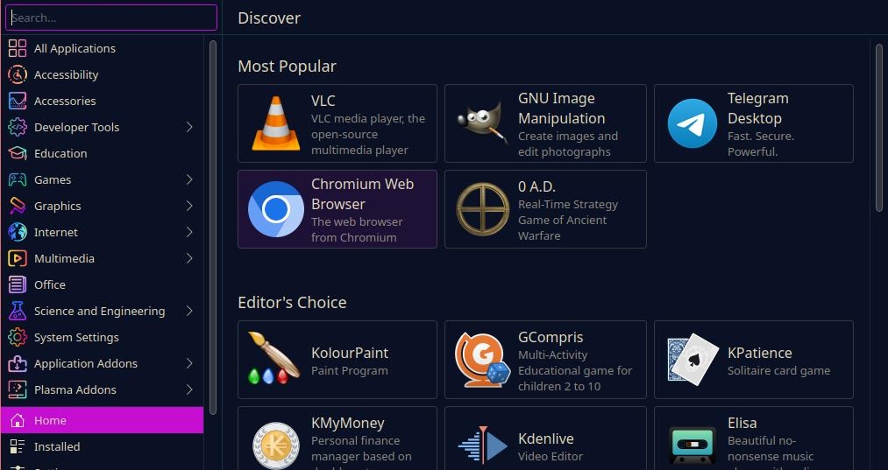
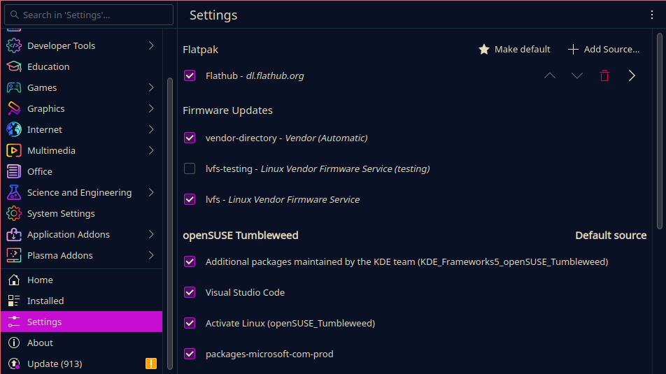

## Your workspace

In the previous installments of this series, we went over the general terms of the Linux world and installed your first Linux distribution `openSUSE Tumbleweed`.

What you see now on your screen will look somewhat familiar to other operating systems you may be used to. And that is by design.

A lot of `Desktop Environments` for Linux distributions try to resemble other operating systems. `KDE Plasma` in particular looks and feels very similar to your pre-Windows-11 Windows desktop.

In this series we will go over how you search for, install, update and uninstall software on your Linux system. What sources can you draw software from and what choices do you have?

## How software works on Linux

In the Linux world, software comes in the form of software `packages`. These `packages` are a collection of files and metadata which make up a specific software application.

They come in the form of package files, with the most popular packaging formats being `.deb` and `.rpm`.

In our case, openSUSE Tumbleweed uses the `.rpm` package file format.

### The package manager

The `package manager` is one of the most important parts of your Linux system that you will be interacting with directly.

A `package manager` is a software tool that lets you install, update and remove pretty much all software on your computer. It automates the entire process around your software including tasks like dependency management, updates, authenticity checks and conflict checking.

Package managers are also used for system updates as they also keep track of all software packages your system needs to function alongside the software you install as the user.

The `package manager` gets its software from the `software repositories` we briefly covered previously.

#### Software Repositories

`Software/Package repositories` are the backbone of the Linux ecosystem. They are the source of all software you can install on your system using your `package manager`.

You can imagine a repository as a directory on a server. Your `package manager` checks that directory every time you want to install or update software if it is available, downloads and installs it for you. All major distributors of Linux operating systems provide their own sets of standard repositories for their distribution which contain software, which is usually checked for errors and safety and will work with your system mostly out of the box.

The default repositories we chose during installation will contain **most** of the software you could ever want to install, though it **is possible to add new repositories**.

Be careful though, adding new repositories maintained by people you do not know or trust may lead to unwanted side effects.

### The software center

Our Tumbleweed install, or rather its Desktop Environment KDE Plasma, comes with a dedicated Software Center called **"Discover"**.



Discover basically handles like an App Store you might be familiar with on Windows or MacOS. You can search and install software and updates via a nice, simple graphical interface.

In the background, Discover uses a tool called `packagekit`, which describes itself as follows:

> "(...) a system designed to make installing and updating
    software on your computer easier.  The primary design goal is to unify
    all the software graphical tools used in different distributions, and
    use some of the latest technology like PolicyKit to make the process
    suck less."

You do not need to remember all that. For our purposes `packagekit` is simply another package manager system.

For our guide however, we want to go over the Linux basics so we will use the Terminal to at least understand how to do this. (You might not always have a desktop interface or software center anyways.)

So go ahead and open the `Konsole` application, which is KDE Plasma's integrated `terminal`. (Technically Terminal Emulator but we will use these words synonymously. For a deep dive into that [click here](https://en.wikipedia.org/wiki/Terminal_emulator))

So, let's take a look at some of our commands of Tumbleweed's `package manager` called `zypper`:

#### Search software

```bash
sudo zypper search $PACKAGE
```

This command tells `zypper` to search for a certain software in its online repositories.

It will return a table to you that shows you all packages it found containing the name you specified instead of the `$PACKAGE` placeholder here.

#### Install software

```bash
sudo zypper install $PACKAGE
```

To install software you use this command. Your package manager will then search for it in its repositories and if found, list what packages will be installed.

In that list, you might notice that not only will it install the package you specified, but additional packages as well.

This is because most software requires additional packages to be installed as dependencies. Do not worry though, `zypper` will not install dependencies you already have installed again as long as they are compatible.

You can shorten this command like this:

```bash
sudo zypper in $PACKAGE
```

#### Remove software

```bash
sudo zypper remove $PACKAGE
```

This will tell `zypper` to search for and remove a package you installed.

```bash
sudo zypper rm $PACKAGE
```

#### Update software

```bash
sudo zypper update $PACKAGE
```

Using this command, you can update individual software packages.

#### Show software details

```bash
zypper info $PACKAGE
```

This will make `zypper` search for and print info about the specified package.

#### System update

```bash
sudo zypper dup
```

This will tell `zypper` to perform a system update. It will then refresh its repositories and search for updates for all installed packages including all system packages.

**Note**: Unlike Windows, most Linux distributions will not force you to reboot after a software update. Some distributions will only apply system level updates after a reboot per default though.

As you can see all of these commands follow a certain pattern:

```bash
sudo $command $parameters
```

The word `sudo` is short for "superuser do" and indicates that the command that follows shall be executed as the superuser or root.

Just like you have to enter you administrator password on Windows machines when installing or running certain software, the manipulation of installed packages requires elevated privileges.

We will come across more cases where we need `sudo` in the future.

### Alternative Sources

If you cannot find a certain software in the official repositories of your distribution, it is possible to get it from other sources.

#### Adding repositories

Just like your distributor has repositories you can access via your package manager, it is possible to add additional repositories to your package manager. These **external** repositories can basically be opened and maintained by anyone who cares to package software for your distribution.

Usually, companies whose software is not accepted or listed into a distribution's standard repositories, because it is in part or completely proprietary for example, will maintain their own repository of their software. In this case, you can find instructions on how to add the repository and install it on their website.

You need to be **careful** though. Because installing software from untrusted sources like unknown people's personal repositories can be equally as dangerous for your system and data as installing software from the second google page on Windows.

So I suggest you stick to the standard repos and add additional one sparingly and only from organizations you can trust.

#### Other packaging formats

Aside from your distribution's package manager, there are other tools that use a similar principle.

One good example are **Flatpaks**. Flatpaks are a cross-plattfrom packaging format which comes with its own package manager.

There are several advantages of using Flatpaks:

- **Isolation**: Flatpaks run in **isolation from the system** in a *sandbox environment*. This can prevent buggy software from impacting your system and increases your system's security as a whole.

- **Self-updating**: Flatpak apps can self-update, meaning you do not need to worry about your software not working after a distribution update.

You can install and use Flatpaks via the Terminal, or by activating Flatpaks in **Discover**.

1. The Terminal: If you want to install and run Flatpaks in the Terminal, open it and run `flatpak --help` to see how that is done. You will notice it is quite similar to using `zypper`.

2. Activating flatpaks in **Discover**. To do so, open Discover and scroll down on the left hand side to `Settings`. Up at the top you will see the menu point **Flatpaks**. Check the box to activate the **Flathub** repositories to use flatpaks.



After that, you can search for, install and run Flatpaks like other software in the software center.

Depending on your distribution and your experience there are many other ways to install certain programs. From different sources.

### Alternatives to unavailable software

Now that we, at length, have covered where you get your software from, we should discuss the elephant in the room:

Some software just is not available on Linux. It just does not exist.

So what do we do now?

Well, thank goodness for the Open-Source communities. For almost every use case there is at least a semi-equivalent or good substitute.

Let's take a look at some of the most common use cases here and see what software you can use to fill gaps left behind by Windows or Mac exclusive software.

#### <span style="text-decoration:underline">Office</span>

On most desktop oriented Linux distributions, some kind of office suite may already be installed. Such is the case here.

`Tumbleweed` comes pre-installed with the `LibreOffice` office suite. This is, as far as I know at least, the most widely used set of office program out there.

You have pretty much everything you need right there: You got your text editor, your excel-like, your presentation software, etc.

Yes, it may not be as polished as the Microsoft Office experience, but it does its job and it does it well most of the time. And this includes importing existing Office documents. Though you have to be careful with certain Macros or Office specific features there.

#### <span style="text-decoration:underline">Image Editing</span>

For image editing, there are a ton of great free tools that you can use depending on what kind of editing you want to do.

If you want to make digital artwork (like I did) one of the most popular choices is [`Krita`](https://krita.org/), a feature-rich digital drawing and image manipulation software made by some of the same people who brought us our Desktop Environment: `KDE Plasma`.

Other prominent choices include [`GIMP`](https://www.gimp.org/), a powerful image manipulation tool similar to the likes of Photoshop, `Pita`, a basic image editor similar to MS Paint, and `InkScape`, an editor similar to Adobe Illustrator.

If you **must use Adobe Photoshop** worry not though, as there are several ways on how to run Photoshop on Linux. Though it is not officially supported (yet) and not open-source software (which is inherently bad of course).

In [this article by Teo Elizalde from MakeUseOf.com](https://www.makeuseof.com/tag/install-adobe-photoshop-linux/) you can find some ways of getting it to work. Though I would guess doing it that way will be a little scuffed around the edges.

#### <span style="text-decoration:underline">Video Editing</span>

If you are into video editing there is one popular choice, coincidentally also developed by KDE (I swear I am not sponsored):
[`Kdenlive`](https://kdenlive.org/en/).

`Kdenlive` is a powerful and feature-rich video editor available for Windows, Linux (Flatpak, AppImage, Ubuntu Package) and Intel Macs.

Though this seems to be a very popular choice it is by far not the only competitor out there: Take a look at this list from [itsfoss.com](https://www.makeuseof.com/tag/install-adobe-photoshop-linux/) to get an overview over the most popular choices.

The choice here really depends on your personal workflow, experience and feature needs so taking a couple minutes to read through these descriptions might be helpful.

#### <span style="text-decoration:underline">Audio Editing</span>

Audio editing is also a huge topic. There used to be one popular choice for everyone no matter on which platform: [`Audacity`](https://www.audacityteam.org/).

While this tool has had its fair share of controversies and scandals regarding privacy and their understanding of open-source in the past, it still seems to be the number one choice and has been for decades.

I am not a musician, audiophile or audio editor by any stretch of the imagination, though the ones I know who are said that they still, after all these years, still find themselves using Audacity a lot of the time because it is available on nearly all systems and is enough for basic audio editing work.

#### <span style="text-decoration:underline">Software Development</span>

If you are a software developer and have not been using Linux yet (where have you been? :P), **welcome to heaven**!

Okay, this may be a little overstatement, but a Linux-based development environment can, depending on the work you are doing and how you are doing it, be easier and more convenient than one on Windows or MacOS.

That is if you do not require certain platform-specific features of these systems.

*Sidenote:* The last time I tried to set up a development environment on Windows has been quite a while so some things may have changed on the  Windows side of things. Though I do remember, very vividly, having to spend quite a while downloading installers from websites and clicking myself through them just to have a certain someone to ask for updates every two days. Looking at you Java.

Linux distributions offer a multitude of tools and languages for software development. In fact, free software movement and (later) the Linux community which grew within it have created many tools that are still used for commercial and non-commercial purposes. One good example would be `GCC`, or the GNU Compiler Collection, a project started by the [GNU Project](https://www.gnu.org/software/) providing compilers for Ada, C, C++, Go and Fortran, which to this day builds the back bone of many Linux and non-Linux systems.

Many Linux distributions come pre-installed with a variety of tools that can be used for software development. For instance, Docker, a popular tool for creating specialized and isolated development, test or execution environments, is readily available and can be easily used on Linux as it comes pre-installed on a lot of distributions.

In the case of `openSUSE Tumbleweed`, several development tools come pre-installed. These include the GCC compiler for C and C++ programming, the `make` utility for building software programs based on a Makefile, and the `gdb` debugger tool for debugging C and C++ programs.

Also, installed are languages like `Python`, alongside its native package manager `pip`, as it is widely used for scientific computing, data analysis, machine learning and web development.

Languages or tools, which are not pre-installed, are usually only one `zypper` command away.

Linux distributions also provides a variety of text editors out of the box which, while minimalistic, are fully functional text editors perfectly fine for writing code. Good examples are the very basic classic `vi`, its less basic brother `vim`, `emacs`, `nano` or `atom`. And thanks to the open-source community you can also switch to a upgraded version of your favorite editor, like `neovim`.

But you also have the option of installing the integrated development environments (IDEs) that you might be familiar with from your experience on Windows or MacOS. From the Linux versions of known fully-fledged IDEs like `VSCode`, its open-source brother `Codium`, to the famous, powerful (and proprietary) [JetBrains](https://www.jetbrains.com/) IDEs, to more basic but extendable Text Editors/IDEs like `Kate` or `Kdevelop` by KDE (I swear I will stop, now).

And the best thing is: **All** of what I have listed **above is managed by your package manager**. Updated automatically for you all at once.

However, while Linux offers many advantages for software development, it also has some limitations. One of the main challenges is the lack of standardization in the ecosystem.
Windows and MacOS have the advantage that they are uniform. Each copy of a certain version of Windows and MacOS will generally behave the same. They each share their **same respective codebases, architectures and design philosophies**. This, compounded by the fact that they are **compiled once** by Microsoft or Apple respectively, ensures that developers only need to account for the specifics of one Version of Windows or MacOS.<br>
**Linux** on the other hand **is very diverse**. Something that I have harped on a lot in the first part of this series. This, in principle, is a great thing. It **allows everyone to modify their distribution to include all the things they like** and **remove all the things they do not like**.<br>
But this is also a huge drawback for developers, as each distribution does things a little differently. From obvious things like which Package Manager or Desktop they use, to little details like the exact name or location of a configuration file or library they might need to slight variations in the version of `Kernel` they use. This is without starting on all the different packaging formats that exist.<br>
All of this can lead to potential issues with compatibility between different distributions. So not very good if you hop a lot between different platforms and distros.

Despite these challenges however, Linux provides a lot of flexibility and power for developers. With the right tools and a bit of familiarity, you can create a comfortable and efficient development environment. I could go on but I will end it here for now.

In the future, I will publish an excursion going into the details of how to set up a working development environment for Python and Rust (the two languages I am currently using the most), so stay tuned for that.

### Wrapping up

Now, this was quite a lot information for one day. Let all of that sink in and try to fiddle around with your system. Why not install a new browser? Or an image editor?

Practice makes perfect! ;)

Thank you for reading all this, I hope you learned something.

Until next time!

---

## Glossary

This was a lot of information thrown at you all at once I know.

Here a quick overview of words used so far.

|Phrase|Description|
|-|-|
|`proprietary software`|Software with non-open-source code (usually kept secret) with non-free licenses and exclusive copyrights to a certain individual or organization.|
|`open-source software`|Software with usually publicly available source code under a free license which allows outside contributions, modifications and copies free of charge. The important thing is not that you have access to the source code though, but that it is licensed under a free license.|
|`Linux`|Refers to the **family of operating systems using some form of the Linux kernel**.|
|`Distribution`|Refers to a specific kind of Linux OS (like Ubuntu, openSUSE, Debian, etc.).|
|`Graphical User Interface / GUI`|All visual elements you can interact with or that represent data.|
|`Desktop Environment (DE)`|The component of a Linux OS that handles the visual interpretation and representation of data and applications and allows for interaction using a GUI.|
|`.iso image`|A operating system "image" is simply a digital copy of an operating system that comes in the format of a `.iso`-file.|
|`software package`|Compressed archive containing all necessary files and data to install and run a give software.|
|`(software) Repository` / `repo`|A storage location from which your system's package manager can access and install software packages.|
|`package manager`|A program which is used to manage, install, uninstall or update installed software packages on your system, apply system updates etc.|

<small>Hero Image by [Claudio Schwarz@unsplash.com](https://unsplash.com/photos/brown-cardboard-boxes-on-brown-cardboard-box-a85IYeAXgxU)</small>
